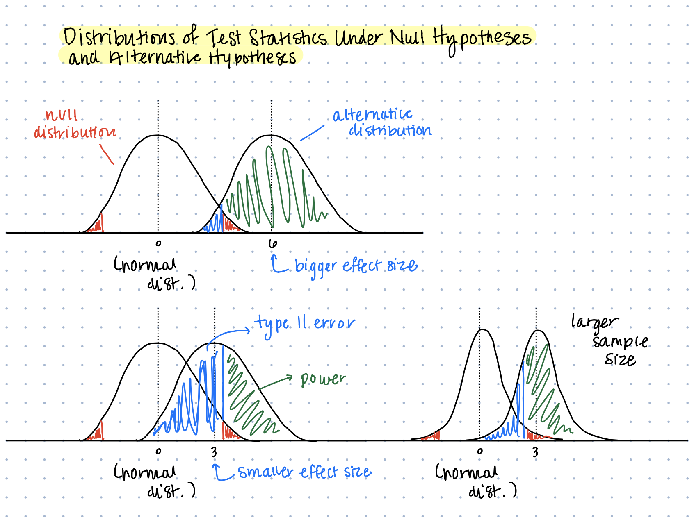

```{r setup, include=FALSE}
knitr::opts_chunk$set(echo = TRUE)
```

## Learning Objectives

- Review hypothesis testing and understand how it relates to survival analysis
- Recognize which tools you should use for specific types of hypotheses

Will try to stick to 35-40 min of material to leave time for discussion!

## Slides

- Slides are available on Canvas
- RMarkdown can be checked out via GitHub

```{sh, eval=F}
git clone
 https://github.com/mbannick/survival-discussion-section.git
```

Or just `git pull` if you already have it cloned!

## Poll Everywhere

We will use Poll Everywhere to take some quick anonymous polls
to stay engaged!

- In your browser on your phone or computer, navigate to PollEv.com/mnorwood
- You will be prompted to do a UW single sign on with your UW login
- Alternatively, text MNORWOOD to 22333 to join the session

## Hypothesis Testing Review

We've talked a lot about various types of hypothesis testing as it relates to survival analysis in this course so far. Let's make sure we're all on the same page with how to do hypothesis testing.

1. State a null hypothesis $H_0$ and an alternative hypothesis $H_A$ (e.g. $H_0: \mu = 0$, $H_A: \mu \neq 0$)
2. Come up with some test statistic that allows you to test your hypothesis (e.g. $\frac{\bar{X} - \mu}{\hat{\sigma}^2/\sqrt{n}}$)
3. Derive the distribution of the test statistic under the null hypothesis and construct rejection regions that control the Type I error rate (basically will always be a normal or chi-squared distribution)
4. Compute your test statistic based on the observed data and see if it falls within the rejection region or outside of the rejection region

## Hypothesis Testing Review

{width=90%}

## Hypothesis Testing Review

{width=90%}

## Examples of Tests

- Tests of model fit (parametric)
- Testing differences in survival at $t$ between groups (parametric and non-parametric)
- Testing differences in survival time quantiles between groups, e.g. median survival (parametric and non-parametric)
- Testing the entire survival curve between groups (parametric and non-parametric)
- Testing differences in the hazard between (potentially many, continuous) groups (semi-parametric)

## Data

```{r}
library(survival)
library(flexsurv)
source("fitparametric.R")
data("diabetic")
head(diabetic)

diab.surv <- Surv(time=diabetic$time,
                  event=diabetic$status)
```

## Data

The "diabetic" dataset from package `survival`

- `id` subject id
- `laser` laser type: xenon or argon
- `age` age at diagnosis
- `eye` a factor with levels of left right
- `trt` treatment: 0 = no treatment, 1= laser
- `risk` risk group of 6-12
- `time` time to event or last follow-up
- `status` status of 0 = censored or 1 = visual loss

## Poll Everywhere: Model Fit

<iframe src="https://pollev-embeds.com/mnorwood" width="800px" height="600px"></iframe>

## Poll Everywhere: Model Fit

<iframe src="https://embed.polleverywhere.com/multiple_choice_polls/IPSYXOVfxCuNsqFVMJ6iQ?controls=none&short_poll=true" width="800px" height="600px"></iframe>

## Model Fit -- Likelihood Ratio Test

Likelihood ratio tests are used to test whether a "richer" or "fuller" model is a better fit
than a less rich or full model (richness based on number of parameters).

- $H_0$: the generalized gamma model does not fit the data any better than the Weibull model
- $H_A$: the generalized gamma model fits the data better than the Weibull model
- **Test Statistic**: the log of the ratio of the likelihoods
- **Null Distribution**: Chi-Squared
- **Key Assumption**: nested models on the same data

## Model Fit -- Likelihood Ratio Test

```{r}
gengamma <- flexsurvreg(diab.surv ~ 1, dist="gengamma")
weibull <- flexsurvreg(diab.surv ~ 1, dist="weibull")

Ts <- - 2 * (weibull$loglik - gengamma$loglik)
1 - pchisq(Ts, df=1)
```

## Poll Everywhere: Differences in Survival at $t$

<iframe src="https://pollev-embeds.com/mnorwood" width="800px" height="600px"></iframe>

## Poll Everywhere: Differences in Survival at $t$

<iframe src="https://embed.polleverywhere.com/multiple_choice_polls/VH9O8WnWiAgs84CU7wAcE?controls=none&short_poll=true" width="800px" height="600px"></iframe>

## Differences in Survival at $t$ -- Wald Test

Wald-type tests are used to test whether or not a parameter is equal to some value $\theta = \theta_0$. If you define your parameter $\theta$ as the difference between two populations' parameters then it fits into the Wald test framework.

- $H_0$: $S_{1}(t_0) - S_{2}(t_0) = 0$ or $S_{1}(t_0) = S_{2}(t_0)$
- $H_A$: $S_{1}(t_0) \neq S_{2}(t_0)$
- **Test Statistic**: the difference in estimated $\hat{S}$ at $t_0$ between the two groups, divided by the square root of the sum of their variance
- **Null Distribution**: Standard normal (could also do T for small samples)
- **Key Assumption**: $S_{1}$ is based off a population independent to $S_{2}$

## Differences in Survival at $t$ -- Wald Test

Both parametric and non-parametric approaches will work. We just need to have some way of getting $\hat{S}(t_0)$ and $Var[\hat{S}(t_0)]$.

We have typically looked at non-parametric in class.

## Differences in Survival at $t$ -- Wald Test

```{r}
km <- survfit(diab.surv ~ trt, data=diabetic)
plot(km, col=c("blue", "orange"), conf.times=20)
legend("topright", c("Untreated", "Treated"), col=c("blue", "orange"),
       lwd=c(2, 2))
```

## Differences in Survival at $t$ -- Wald Test

We can extract the survival estimates and standard error for both
groups at a specific `time=20`, then perform a Wald-type test by comparing
the test statistic to a normal distribution.

```{r}
s <- summary(km, times=20)
diff <- s$surv[2] - s$surv[1]
se <- sqrt(s$std.err[2] ** 2 + s$std.err[1] ** 2)
(1 - pnorm(diff / se))*2
```

## (2) Poll Everywhere: Differences in Survival Times

<iframe src="https://pollev-embeds.com/mnorwood" width="800px" height="600px"></iframe>

## (2) Poll Everywhere: Differences in Survival Times

<iframe src="https://embed.polleverywhere.com/multiple_choice_polls/GiIX36b4PCHqfgtj4trpm?controls=none&short_poll=true" width="800px" height="600px"></iframe>

## Differences in Survival Times -- Wald Test

We would use the exact same strategy as before, only now our hypothesis would
be $H_0: t_1(p) = t_2(p)$. Where `p` is the survival probability we're interested in (e.g. 0.5 for the median).

## Differences in Survival Times -- Wald Test

We can get confidence intervals from a `survfit` object for these times,
but we don't have a convenient way of getting standard errors to perform the test.

```{r}
q <- quantile(km, probs=0.10)
tab <- cbind(q$quantile, q$lower, q$upper)
colnames(tab) <- c("est", "lower", "upper")
tab
```

## Poll Everywhere: Differences in Whole Survival Experience

<iframe src="https://pollev-embeds.com/mnorwood" width="800px" height="600px"></iframe>

## Poll Everywhere: Differences in Whole Survival Experience

<iframe src="https://embed.polleverywhere.com/multiple_choice_polls/o8jKPNdSZRzqbMt32U3aW?controls=none&short_poll=true" width="800px" height="600px"></iframe>

## Differences in Whole Survival Experience -- Logrank Test

The logrank test looks at differences in survival at each observed time $t$ (in any group) and compares the number that died and did not die, out of those who were at risk.

It sums these observed counts minus the expected counts (death does *not* differ across groups).

## Differences in Whole Survival Experience -- Logrank Test

- $H_0$: $S_0(t) = S_1(t)$ over all $t$
- $H_A$: $S_0(t) = S_1(t)$ *for any $t$*
- **Test Statistic**: the difference between observed and expected counts over all times, summed up, squared, divided by variance
- **Null Distribution**: Chi-squared
- **Key Assumption**: Will have low power if the hazard functions cross (recall that the summation is on the **inside** of the square)

## Differences in Whole Survival Experience -- Logrank Test

```{r}
survdiff(diab.surv ~ trt, data=diabetic)
```

```{r}
1 - pchisq(22.2, df=1)
```

## Differences in Whole Survival Experience -- Logrank Test

Note that if we are in the *parametric setting*, the entire curve
is determined by the parameter(s) indexing that distribution (e.g. the hazard for exponential).

Testing whether the survival distributions are different between the two groups
amounts to testing whether the parameters are the same, again with the Wald test.

Which would you rather do?

## Poll Everywhere: Differences in Whole Survival Experience II

<iframe src="https://pollev-embeds.com/mnorwood" width="800px" height="600px"></iframe>

## Poll Everywhere: Differences in Whole Survival Experience II

<iframe src="https://embed.polleverywhere.com/multiple_choice_polls/HEaeLc3FdmK3v7Gz8Wicr?controls=none&short_poll=true" width="800px" height="600px"></iframe>

## Differences in Whole Survival Experience II -- Stratified Logrank Test

The stratified logrank test is an extension of the logrank test that allows us to sum of the observed - expected counts across all times, **within strata**.

This is like stratified analysis that you learn about in epi. The idea is that once even one strata has survivorship differing between the groups at one time, that's evidence against the null (assuming it doesn't cancel out because of crossing hazard functions).

## Differences in Whole Survival Experience II -- Stratified Logrank Test

- $H_0: S_{j1}(t) = S_{j0}(t)$ for all groups $j$ and times $t$
- $H_A: S_{j1}(t) \neq S_{j0}(t)$ for **some** group(s) $j$ and **some** time(s) $t$

This could also be framed as $h_{j0}(t)$ as in the lecture slides, since $S$ is just the product of 1 - hazard for all $t_i \leq t$.

## Differences in Whole Survival Experience II -- Stratified Logrank Test

Look at association between blindness and treatment, controlling for baseline risk level (although this shouldn't be a confounding variable since each person acted as their own control).

```{r}
survdiff(diab.surv ~ trt + strata(risk), data=diabetic)
```

## Poll Everywhere: Testing differences in hazards between groups (potentially continuous variable)

<iframe src="https://pollev-embeds.com/mnorwood" width="800px" height="600px"></iframe>

## Poll Everywhere: Testing differences in hazards between groups (potentially continuous variable)

<iframe src="https://embed.polleverywhere.com/multiple_choice_polls/XwcRMtRw8OLuCIXtE6AE9?controls=none&short_poll=true" width="800px" height="600px"></iframe>

## Testing differences in hazard with continuous variable -- Cox Proportional Hazards Regression

Recall that there were two contributions to the likelihood when we talked about fitting parametric models:

- $f(t|\lambda) = \lambda e^{-\lambda t}$ for observed at $t$
- $S(t|\lambda) = e^{-\lambda t}$ for censored at $t$

We could parameterize the $\lambda = e^{\beta_0 + \beta_1 x_1 + ... + \beta_p x_p}$. But the drawback is that we're assuming some parametric form for $f$. Semi-parametric regression is preferred here.


## Testing differences in hazard with continuous variable -- Cox Proportional Hazards Regression

The idea is that we can relax the assumption about the parametric form of $f$. Instead, we just say that there is some unknown baseline hazard $\lambda_0(t)$ and the covariates modify this hazard in a **proportional** way.

$$\lambda(t) = \lambda_0(t) e^{\beta_1 x_1 + ... + \beta_p x_p}$$
Compare this to the fully parametric regression model we had on the previous slide. Where did $\beta_0$ go? And why didn't we have $\lambda(t)$ before?

## Testing differences in hazard with continuous variable -- Cox Proportional Hazards Regression

We will see in lecture that with the Cox model, we don't actually estimate $\lambda_0(t)$. And instead of using a full likelihood we use a partial likelihood. It allows us to focus on the estimation of the effects $\beta_1, ..., \beta_p$.

How would you construct a test to see if the hazard is different based on a variable $x_1$?

Stay tuned!
