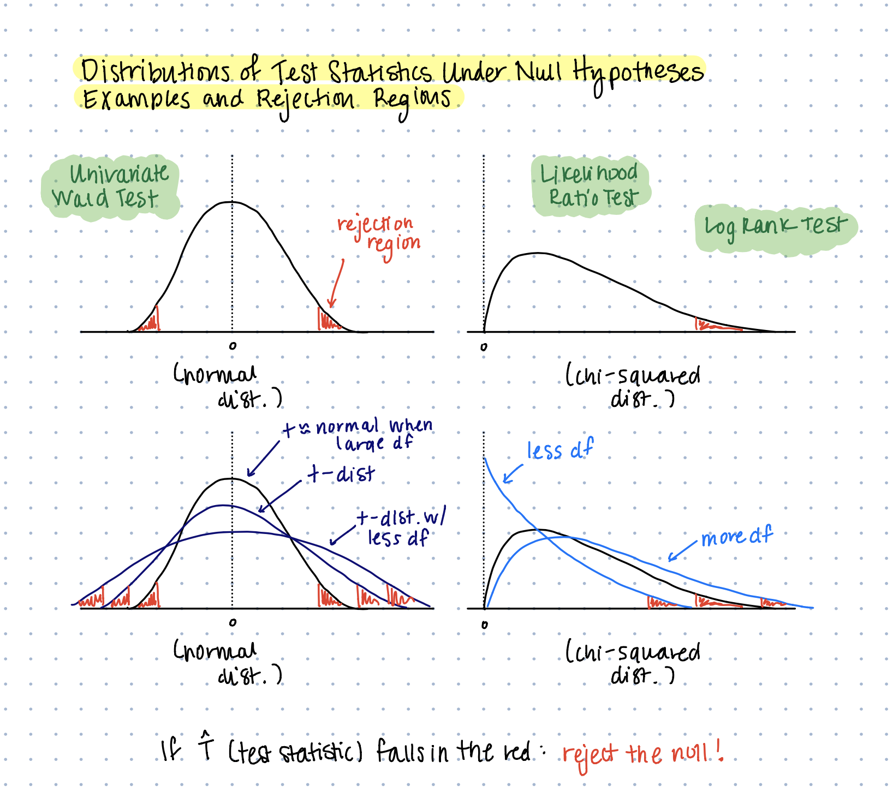

```{r setup, include=FALSE}
knitr::opts_chunk$set(echo = TRUE)
```

## Learning Objectives

- Review hypothesis testing and understand how it relates to survival analysis
- Recognize which tools you should use for specific types of hypotheses

## Slides

- Slides are available on Canvas
- RMarkdown can be checked out via GitHub

```{sh, eval=F}
git clone
 https://github.com/mbannick/survival-discussion-section.git
```

Or just `git pull` if you already have it cloned!

## Poll Everywhere

We will use Poll Everywhere to take some quick anonymous polls
to stay engaged!

- In your browser on your phone or computer, navigate to PollEv.com/mnorwood
- You will be prompted to do a UW single sign on with your UW login
- Alternatively, text MNORWOOD to 22333 to join the session

## (1) Hypothesis Testing Review

We've talked a lot about various types of hypothesis testing as it relates to survival analysis in this course so far. Let's make sure we're all on the same page with how to do hypothesis testing.

1. State a null hypothesis $H_0$ and an alternative hypothesis $H_A$ (e.g. $H_0: \mu = 0$, $H_A: \mu \neq 0$)
2. Come up with some test statistic that allows you to test your hypothesis (e.g. $\frac{\bar{X} - \mu}{\hat{\sigma}^2/\sqrt{n}}$)
3. Derive the distribution of the test statistic under the null hypothesis and construct rejection regions that control the Type I error rate (basically will always be a normal or chi-squared distribution)
4. Compute your test statistic based on the observed data and see if it falls within the rejection region or outside of the rejection region

## (1) Hypothesis Testing Review

{width=90%}

## (1) Hypothesis Testing Review

{width=90%}

## (2) Examples of Tests

- Tests of model fit (parametric)
- Testing differences in survival at $t$ between groups (parametric and non-parametric)
- Testing differences in survival time quantiles between groups, e.g. median survival (parametric and non-parametric)
- Testing the entire survival curve between groups (parametric and non-parametric)
- Testing differences in the hazard between (potentially many, continuous) groups (semi-parametric)

## (2) Examples: Data

```{r}
library(survival)
library(flexsurv)
data("diabetic")
head(diabetic)

diab.surv <- Surv(time=diabetic$time,
                  event=diabetic$status)
```

## (2) Examples: Data

The "diabetic" dataset from package `survival`

- `id` subject id
- `laser` laser type: xenon or argon
- `age` age at diagnosis
- `eye` a factor with levels of left right
- `trt` treatment: 0 = no treatment, 1= laser
- `risk` risk group of 6-12
- `time` time to event or last follow-up
- `status` status of 0 = censored or 1 = visual loss

## (2) Poll Everywhere: Model Fit

<iframe src="https://pollev-embeds.com/mnorwood" width="800px" height="600px"></iframe>

## (2) Poll Everywhere: Model Fit

<iframe src="https://embed.polleverywhere.com/multiple_choice_polls/IPSYXOVfxCuNsqFVMJ6iQ?controls=none&short_poll=true" width="800px" height="600px"></iframe>

## (2) Examples: Model Fit -- Likelihood Ratio Test

Likelihood ratio tests are used to test whether a "richer" or "fuller" model is a better fit
than a less rich or full model (richness based on number of parameters).

- $H_0$: the generalized gamma model does not fit the data any better than the Weibull model
- $H_A$: the generalized gamma model fits the data better than the Weibull model
- **Test Statistic**: the log of the ratio of the likelihoods
- **Null Distribution**: Chi-Squared
- **Key Assumption**: nested models on the same data

## (2) Examples: Model Fit -- Likelihood Ratio Test

```{r}
gengamma <- flexsurvreg(diab.surv ~ 1, dist="gengamma")
weibull <- flexsurvreg(diab.surv ~ 1, dist="weibull")

Ts <- - 2 * (weibull$loglik - gengamma$loglik)
1 - pchisq(Ts, df=1)
```

## (2) Poll Everywhere: Differences in Survival at $t$

## (2) Poll Everywhere: Differences in Survival at $t$

## (2) Examples: Differences in Survival at $t$ -- Wald Test

## (2) Examples: Differences in Survival at $t$ -- Wald Test

## (2) Poll Everywhere: Differences in Survival Time Quantiles

## (2) Poll Everywhere: Differences in Survival Time Quantiles

## (2) Examples: Differences in Survival Time Quantiles -- Wald Test

## (2) Examples: Differences in Survival Time Quantiles -- Wald Test

## (2) Poll Everywhere: Differences in Whole Survival Experience

## (2) Poll Everywhere: Differences in Whole Survival Experience

## (2) Examples: Differences in Whole Survival Experience -- Logrank Test

## (2) Examples: Differences in Whole Survival Experience -- Logrank Test

## (2) Poll Everywhere: Differences in Whole Survival Experience II

## (2) Poll Everywhere: Differences in Whole Survival Experience II

## (2) Examples: Differences in Whole Survival Experience II -- Stratified Logrank Test

## (2) Examples: Differences in Whole Survival Experience -- Stratified Logrank Test

